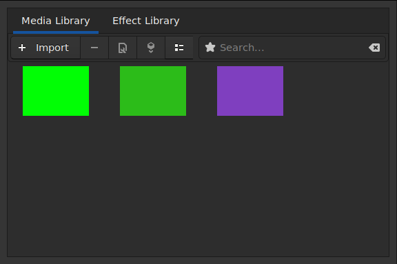
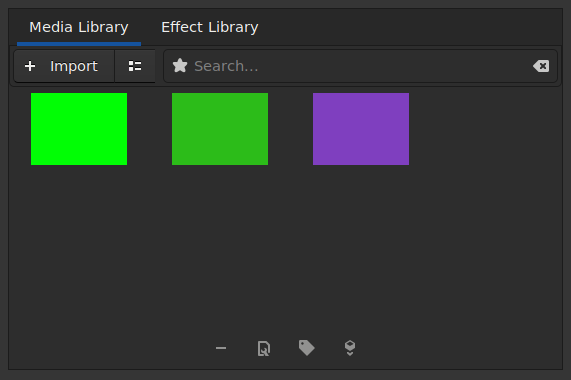
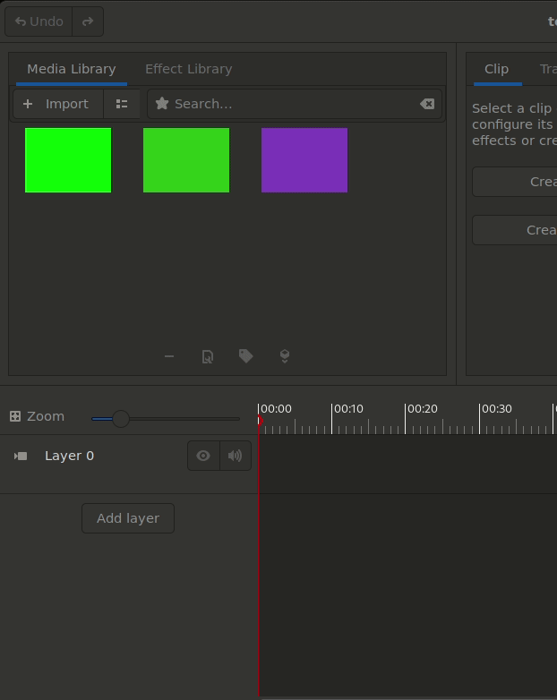
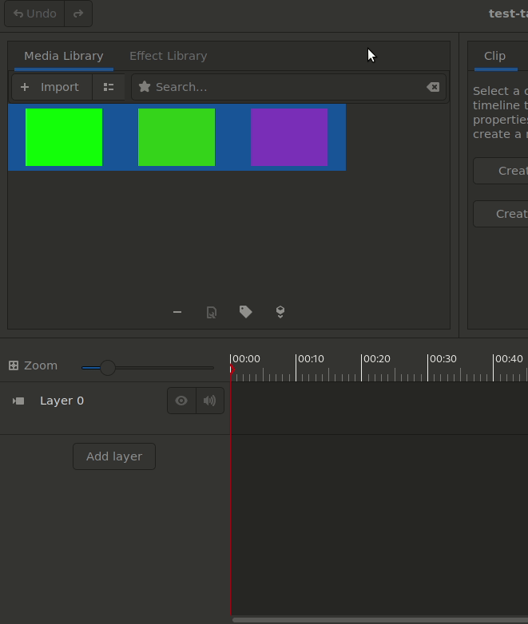

During this summer I improved Pitivi’s Media Library. The work included both refactoring and adding new functionalities. My [proposal](https://docs.google.com/document/d/1QK97dKm89BcAoO5N25EsDBCTqmb-mz0_g6h8YuFAFN0/edit?usp=sharing) has a detailed roadmap on the goals I set to achieve during this summer.
### Initial cleanup
To prepare the codebase for introducing new modes of displaying the clips in the Media Library, I refactored the code to unify the iconview and listview modes of the Media Library into a single responsive grid view. The two modes were using different types of widgets, requiring duplicate logic. Now both iconview and listview modes are powered by a single [Gtk.FlowBox](https://lazka.github.io/pgi-docs/#Gtk-3.0/classes/FlowBox.html#Gtk.FlowBox) widget.
Issue [#1343](https://gitlab.gnome.org/GNOME/pitivi/-/issues/1343)

**[Link To Submitted MR.](https://gitlab.gnome.org/GNOME/pitivi/-/merge_requests/305)  ( merged )**

**[Link To Related Blog.](https://gaharavara.github.io/refactoring-pitivi-%20medialibrary/)**

### Shifting the asset action buttons to a new action bar
The Tagging functionality is accessed through a new Tag button, for which we needed to make space since the MediaLibrary's toolbar was already very crowded.

We decided to group all the buttons related to the selected clips on a new toolbar at the bottom of MediaLibrary. Initially we came up with a design of a floating toolbar at the bottom using [Gtk.Overlay](https://lazka.github.io/pgi-docs/index.html#Gtk-3.0/classes/Overlay.html#Gtk.Overlay). We went through a number of iterations on various ways to place it and settled on using a standard [Gtk.ActionBar](https://lazka.github.io/pgi-docs/#Gtk-3.0/classes/ActionBar.html#Gtk.ActionBar) which is designed to present contextual actions, exactly what we needed.
 

**[Link To Submitted Commit.](https://gitlab.gnome.org/GNOME/pitivi/-/merge_requests/318/diffs?commit_id=a760f69687d876394a7bc5f54cabdf7da8069953)**

### Tagging clips in the Media Library
I introduced a new Tag button which reveals a Popover for tagging the selected clips. A clip can have multiple tags. Multiple clips can have common tags. 

The [Gtk.Popover](https://lazka.github.io/pgi-docs/index.html#Gtk-3.0/classes/Popover.html#Gtk.Popover) shown by the Tag button displays all the tags  using a **Gtk.ListBox**. The state of each tag can be controlled using a Gtk.CheckButton. A CheckButton is "checked" when all the selected clips have the corresponding tag, "unchecked" when none of the clips have the tag, and "inconsistent" when only some of the clips have the tag. Clicking the CheckButton takes it through the three states. 

**A Gtk.Entry** allows to specify a new tag to be associated with all the selected clips. 

**An "Apply"** button saves the changes in the project. The Apply button remains disabled unless there are changes to be applied. It does not permit creating a duplicate tag.
Note: After applying the change via the Apply button it is not written in the project’s xges files. To do so we need to save the project.
Taking advantage of the fact that the GES.UriClipAsset is a GES.MetaContainer, we store the tags under the individual clip’s metadata ( "pitivi::tags" ). When saving the project, the tags are thus saved in the project’s xges file. While working on saving and retrieving asset metadata we encountered a minor bug in GES because of which we were unable to retrieve the saved metadata from a reloaded project. So we worked on a fix before moving on.

I introduced new test cases exercising the UI for addition and removal of tags under several scenarios.
Issue **[#537](https://gitlab.gnome.org/GNOME/pitivi/-/issues/537)**

**[Link To Submitted MR.](https://gitlab.gnome.org/GNOME/pitivi/-/merge_requests/318)**

### Filtering of clips based on their tags
After completing the Tagging feature our plan was to utilise it for filtering the clips. We worked on extending our current search functionality to include searching by tags. Luckily the search bar in MediaLibrary is composed of Gtk.Entry which has a convenient method [set_completion](https://lazka.github.io/pgi-docs/index.html#Gtk-3.0/classes/Entry.html#Gtk.Entry.set_completion) to assign an [Gtk.EntryCompletion](https://lazka.github.io/pgi-docs/index.html#Gtk-3.0/classes/EntryCompletion.html#Gtk.EntryCompletion) to it.

Gtk.EntryCompletion allows us to use Gtk.TreeStore to provide suggestions based on the text or key entered inside the Gtk.Entry. We already had a global set of tags maintained in the MediaLibrary for the tagging feature. We used it to fill the [model](https://lazka.github.io/pgi-docs/Gtk-3.0/classes/EntryCompletion.html#Gtk.EntryCompletion.set_model) required by Gtk.EntryCompletion. We utilise it’s built in Autocompletion and Popover to manage our filtering operation using tags.

**[Link To Submitted MR.](https://gitlab.gnome.org/GNOME/pitivi/-/merge_requests/318)**

### Work To Be Done
The work in https://gitlab.gnome.org/GNOME/pitivi/-/merge_requests/318 is currently under review, polishing and updating it as per the reviews would be my priority. The introduced test cases for Tagging feature can be reduced and extended to cover more scenarios.

One of the extended goals was to introduce filtering clips by date, we need to finalize the roadmap of this feature and my goal would be to implement it.

Updating the user manual to mention the Tagging Feature is also a task that I intend to do.

### I am grateful to
**Thibault Saunier** and **Alexandru Băluț** for all the guidance and support they have given me throughout my time working at Pitivi, they were always present to solve so many of my doubts patiently. Without their support this much work would not have been possible.
