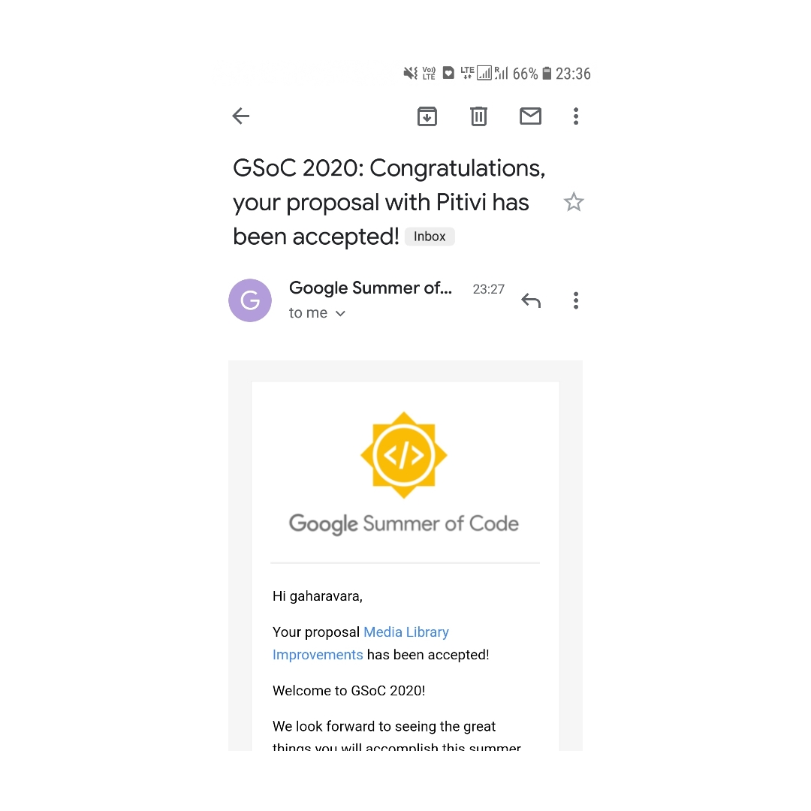

I think it was around 11:30pm in the night and I was sure about receiving a mail from google anytime soon, will I be accepted or rejected? I was so nervous that I was thinking of going to sleep and maybe check it in the morning!

Then a thought about respecting the efforts I had put in came and I thought let's see whatever it is, I'm not gonna insult my hard work by hiding from the result!

When I read the email stating me being accepted!! my heart started beating so fast I could literally hear it ( after so long xD ), anyways when even after some time it didn't stop, I seriously thought it was going to burst LMAO, so I plugged in my earphones and  played a song that I came across that day itslef and tried sleeping :P

BTW in case if you are wondering, [Famy - Ava](https://www.youtube.com/watch?v=O6DgEypcTp4) is that song!

Here I go again! this blog was supposed to be technical.  
:P
To give it some technical context, here is the [ technical summary of my project ](https://summerofcode.withgoogle.com/projects/#5013603540795392).
I will dedicate a special post to [Pitivi](http://www.pitivi.org/) and my Journey of discovering this wonderful Organization!!!!