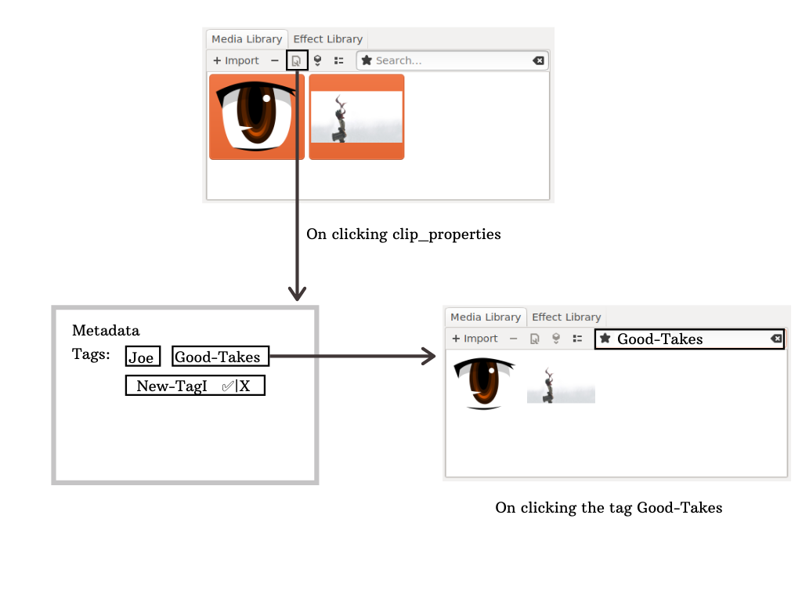

Since my GSoC project is about improving Pitivi's Media Library and introducing new features to it, the first task was to clean it up.

To display assets the Media Library used a Gtk.TreeView widget to show a detailed list view and a Gtk.IconView widget to show a simpler icon view. Some major drawbacks with the previous implementation using two separate widgets are:
  - We had two widgets in memory ( we toggled their visibility to switch between the list view and the icon view )
  - We had redundant code and callbacks for the same signals ( one to handle Gtk.TreeView and the other for Gtk.IconView )
  - Any new feature would require us to implement it in two widgets, using two widgets also brought their native bugs with them

What we needed was a single widget that could support both views, saving us from all the aforementioned drawbacks. Luckily such a widget called [Gtk.FlowBox](https://developer.gnome.org/gtk3/stable/GtkFlowBox.html) was introduced in GTK 3.12, six years ago.

The plan was to only use Gtk.FlowBox under the hood to display both list view and icon view, hence refactoring the already present logic into Gtk.FlowBox was  the only task.

Now let us look at some technical details around how we're using **Gtk.FlowBox and how we refactored the code**.

### First leap:
One idea was to first refactor listview and then iconview into Gtk.FlowBox. This seemed a good approach at first as we were breaking a big task into smaller steps, but soon an issue came up.

Gtk.FlowBox uses Gio.ListStore, while Gtk.TreeView and Gtk.IconView rely on Gtk.TreeModel. If we kept one of the previous widgets we would have to keep the  TreeModel along with it too. This would just add unnecessary tasks to the project, we would have to add some temporary methods to parse and sync both the models. So after a brief discussion it was decided we simply go all in. There was no actual need of breaking the task in two parts in the first place.

### Setting up Gtk.FlowBox for the first time:
I started by introducing a minimal Gtk.FlowBox widget and commenting out all the code that powered the previous views. Initially it took some time to get used to FlowBox and figuring out on how to actually use Gio.ListStore with Gtk.FlowBox.

### The way we toggle between views:
In the previous approach we were switching between the Gtk.TreeView and Gtk.IconView widgets having one of them visible at a time. Initially I replicated a similar approach for FlowBox, keeping two widgets per item.

We preferred to keep the logic simpler and instead to recreate the widgets when the view mode is changed. This approach was easily possible with FlowBox by [re-binding the model](https://developer.gnome.org/gtk3/stable/GtkFlowBox.html#gtk-flow-box-bind-model) and specifying a different create_widget_func. This also saved us from wasting memory in storing two sets of child widgets.

### Setting up Drag and Drop along with Rubber Band selection:
This task took a significant amount of time. In my first implementation of Drag and Drop the dragging wouldn’t work at all, instead multiple items would get selected in the direction of dragging. At first I didn’t look much into the cause behind this behaviour, my initial stance was maybe I was not implementing the drag and drop correctly in Pitivi. After a lot of debugging when nothing worked, I realized I should try implementing it in a minimal Python script first. This is when I noticed by default in FlowBox if we drag over it’s children they come under rubberband selection.

The first subtask was to stop this behaviour because in Pitivi the users would prefer dragging the asset to timeline by default over selecting multiple assets.There was no clear way how to differentiate between dragging as in drag and drop and dragging in case of rubberband selection. To get a better idea what's going on, I looked into the codebase of Gtk.FlowBox where I found it used Gtk.Gestures to govern the rubberband behaviour but I still couldn’t find anything on how to distinguish it from a drag and drop operation.

In Pitivi’s previous implementation Gtk.IconView had both of these operations perfectly working together. A major point I came across while playing with it was that one could only initiate the rubberband selection from an empty space. Dragging over an asset would simply initiate a drag and drop operation. I then decided to read the codebase of Gtk.IconView to better understand how to implement/replicate it in Pitivi.

Now we differentiate between drag & drop and the rubberband selection by controlling the propagation of the "button-press-event" signal. In case if we propagate the signal further by returning True in the button-press-event handler we say yes to rubberband selection, which means everything you drag upon is selected. If we don’t propagate the signal by returning False, we block the default behaviour and drag and drop comes into play.

How do we decide whether to propagate the signal or not ?
This is inspired by Gtk.IconView, we simply check if there is any asset under the cursor when we start dragging, if yes the dragging is meant for a drag and drop operation so we block the propagation of the "button-press-event" signal. Otherwise we propagate the signal which results  into rubberband selection.

We have logic to better govern this behaviour in the button-press-event callback method.

P.S. A shout out to the last implementation, the codebase was pretty readable and I actually never had to go through any struggles in understanding what was going on in the previous implementation and that was a major booster !

### What’s next in Pitivi ?
Now with the upgraded Media Library we are all set to introduce new features ! The first one we are working on is **Adding Tagging functionality to clips which will allow us to display the assets by tag as a Folder View.**

This feature empowers Pitivi’s user base to categorize their assets in the Media Library. An asset can have multiple tags. Multiple assets can have common tags. Assets can be filtered based on their tags by searching.

The first step is to extend the current asset properties dialog to include a **Tags** property and a proper way to add and store new tags.

The second step is to extend it to manage possible operations on tags in case multiple assets are under selection!

Last step would be to introduce The Folder View, which shows the assets into folders based on their tags.