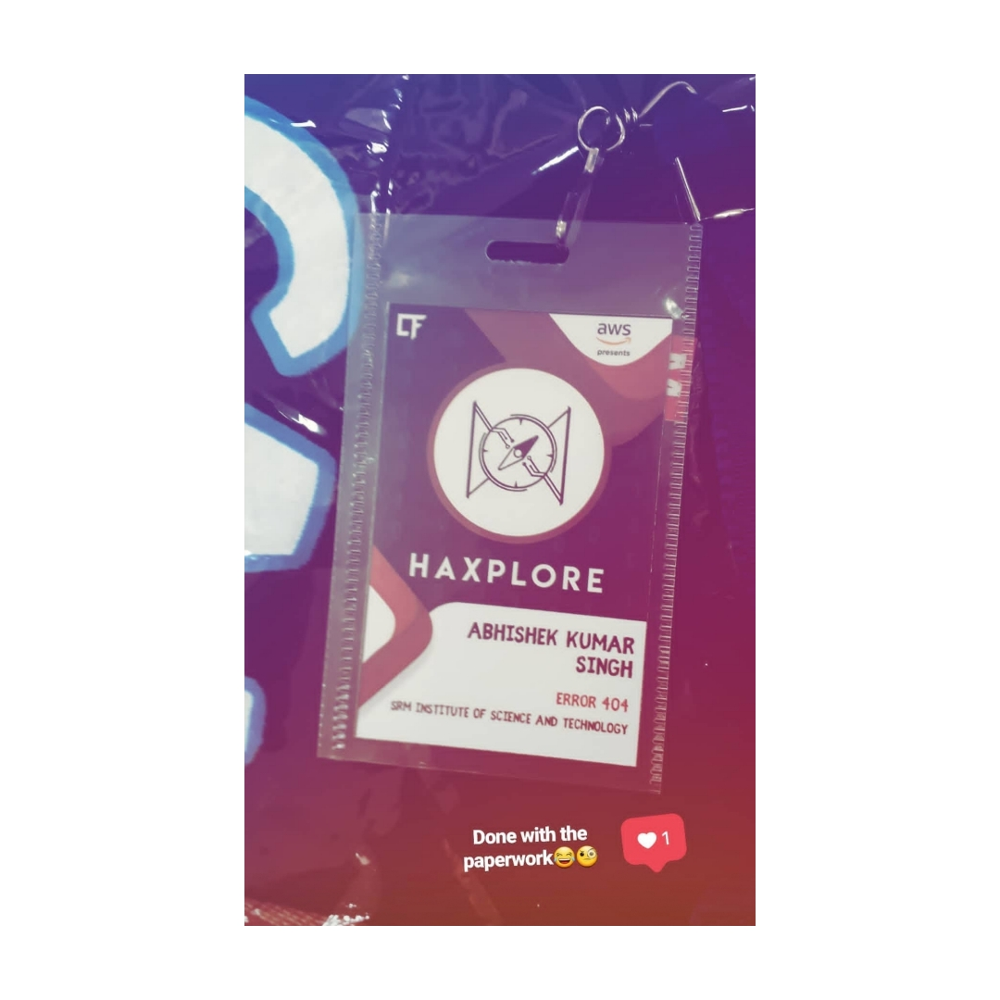

### An invitation!
My journey to Haxplore 2019 led me to the most distant place I travelled for
attending a hackathon, it was a hackathon by IIT BHU afterall + we got 
travel reimbursements! ( thanks to them for taking care of our accomodation too ),
it was their first time organizing a hackathon! and we had high hopes from this hackathon.

### Journey to Benaras
Our team of three departed from Ghaziabad, India to travel around 800 Kms to reach Varanasi.

>Insight: Varanasi or Benaras is the oldest living city of the world and is the city of our 
lord Shiva, you must have heard the chants of Om, yeah that's his signature!

side note: Varanasi is also the neighbouring city to my hometown.

Our journey was a 14hrs journey via train and it went quite well! we had planned on deciding what to make
in the hackathon during this duration but the window seat took it all away! initially we had a little 
discussion on certain ideas but then we put on our earphones turned the music on and kneeled our heads on the 
window looking at the view outside. It was peaceful, we spent our time talking before we fell asleep ....

### Setting foot in BHU
The next morning our train was right on time ( for Indian railway it's a big thing ) and we reached our destination, 
the station was the most beautiful station of Indian railways that I ever came across! we got some snacks and booked
a cab to BHU.( I could mention a lot here like incident at the snack shop, incident with OLA but I will keep this part short )

BHU or Benaras Hindu University is like a city in itself, you have to take e-rickshaw to travel from one department building to another, 
that is the size of this university. It was my first time seeing this huge university, anyway I already had an idea of what to expect! our venue was Malviya 
block where we had to do some paperwork on the registration booth for identification and later after completion, we were provided 
with our haxplore ID cards and some CODEFEST goodies.

We were guided to our accomodation, a lot of other participants were already present and more were coming, after settling down, we talked to a number of other teams! we found out people had travelled from various parts of India, a certain team was planning on to visit the city after an hour and asked us to join them, we were 
pretty excited but a lot tired at the same time so we decided to take a break first and asked them to go on, in the eve we too set out to explore the city :D

We started by roaming around BHU, we ate bati chokha ( it's one of the best dishes of my side which I was longing for! ) then we took an auto to visit assi ghat, it was flooded at that time, water was near to the top stairs, we couldn't go for boating :(
    instead we went for sipping masala tea! and watching the holy river Ganga flow.

At night we finally concluded on what to build and then went to sleep since the next day was going to be hectic. The next morning we were all set for the hackathon! 

### Haxplore'19
In the morning we were informed about the venue of the hackathon, it was the CSE department building of IIT BHU, we were told it was only around 1km far so we decided 
to walk! while on route we saw a lot of other teams too approaching the venue, everyone was wearing the provided Haxplore t-shirts so it was quite easy to find our way to the venue. 

We all gathered in a mini auditorium, after breakfast we had an inauguration ceremony followed by code of conduct for the hackathon and a quick event related doubts clearing session by the organizers. 
> We were told by the organizers that out of 120+, only 40 teams had been shortlisted to attend this hackathon so we should appreciate the fact that we made it this far.

It was a moment of happiness for each one of us. We were divided into 2 groups and were provided guided to our Hackathon venue in the neighbouring building.

The hackathon had officially started, our team Error 404 started by making sure each of our systems had proper internet connection ( hehe, afterall hackathons are all about bottlenecks and googling ). We started from scratch, first step was
to determine our end product on paper, we marked the essential features that were needed to make a presentable protoype by the end of 24 hrs, advanteges that come with certain features and what to really build to include in the prototype.

The breaks for snacks in the eve and the dinner at night were the only breaks we took. During that time we talked with other participants, we even met a team that was from SRM, Amravati campus! ( our team was from SRM, NCR campus )

**The first issue I faced was related to asynchronous programming in JS when working on the node server while using google maps API( It was an afternoon and eve-mare for me, I ended up wasting a lot of my time here ). I was a bit above beginner level in knowledge about using 
google maps API, but the functionality we were trying to achieve here was quite complex. It got done somehow, a lot of hacks :)**

Somewhere around this time we had our first round of evaluation, there were three judges who were GitHub campus experts from their respective colleges, the judge evaluating 
our idea was quite impressed, we were told in case if we complete the project we will surely be among the top teams that will pitch during the final round. This was a real booster for our team.

Later in the night I was working on integrating socket.io for the push notifications feature needed in our project when I was interrupted by a guy who was sitting right next to our team he told me that socket.io was an awesome framework and really makes a lot of jobs so much easier, I couldn't agree more! We talked a bit about the projects we were building, since we were both short on time we got back to working. 
Later in the night during one of the fun events I got to know that this guy was a high school student! I was quite shocked and impressed at the same time, he even travelled from the same city as me ( a shocking co-incideence )

Our team had to pull an all nighter, but in the morning we were nearly ready with our prototype the backend was done ( it was not completely satisfactory but it was working ), In the morning itself I had a heavy head, when consulted with other team memebers they too had the same! so, for frontend we agreed on having just skeleton html and cicumstancial css and js. In the morning the Hackathon was supposed to end around 11:00 am.

Later while one of my team mates was doing some API changes we ran into the biggest blunder of this hackathon, by mistake a conditional loop ran for some infinite time doing some infinite API calls
( in case if you guessed! yeah ) our solution was utilizing the free google credits recieved on opening a new account with google maps API and registering your debit card! We were 
using google firebase too, all the credits got exhausted because of that blunder:(

We contacted the judges, we looked for some alternative! but at this point it was too late we needed to have a working model to qualify for the final pitching and the organizers re-iterated that the hackthon was sponsored by AWS so they could only help 
with AWS related issues any help related to google related services from their side was not possible at that moment, the main judges too were from Amazon. This was 
really a sad end for us, it was the most unexpected issue we ran into! what we thought was hitting a bug or bottleneck related to integration or bakcend mechanisms. So we had proper time alloted for them and through the all nighter we overcomed all of such issues.

Anyways after 10:30am we left the venue to head back to our accomodation, we again encountered Daksh ( the high school guy), we had a decent conversation and were 
annoyed that the final pitching was kept confidential to the top teams only. He told us he was unable to complete his webapp. He had his train in the evnening while our train was the next day evening.

We were too tired to do anything, the all nighter we pulled and the train journey it all came back, I myself was so tired that I barely just woke up for dinner then again 
went to sleep.

### Visit to Sarnath
The next morning we packed our stuff headed out of BHU ( we kind of woke late and missed the breakfast ), we were accompanied by one more guy from the Hackathon, we 
had our breakfast-lunch together then we parted ways with him as he had a flight in the afternoon. We headed to the destination we planned on visiting before leaving 
Varnasi. It was Sarnath, it is a famous worshipping place for Budhists, we visited the museum, and the big Buddha shrine along with the mini zoo, all located in the 
Sarnath area. Their was even a bit of rain in the mid, We passed the whole afternoon exploring Sarnath. It was a real soothing and peaceful experience for us after all
the hustle we did in the past days.

In the evening we were back on the station to catch our train and head back to our college.

